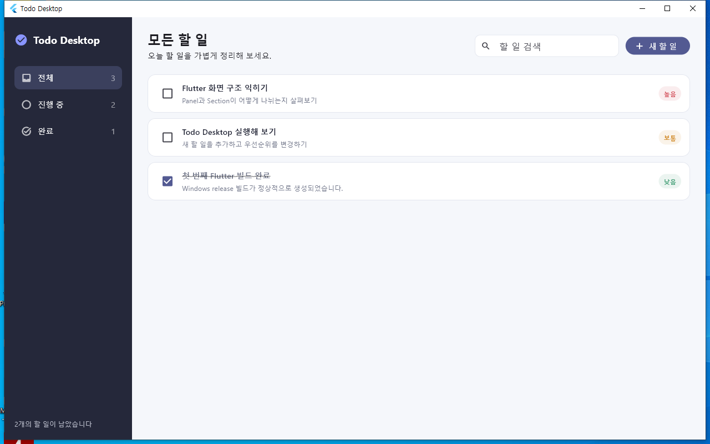
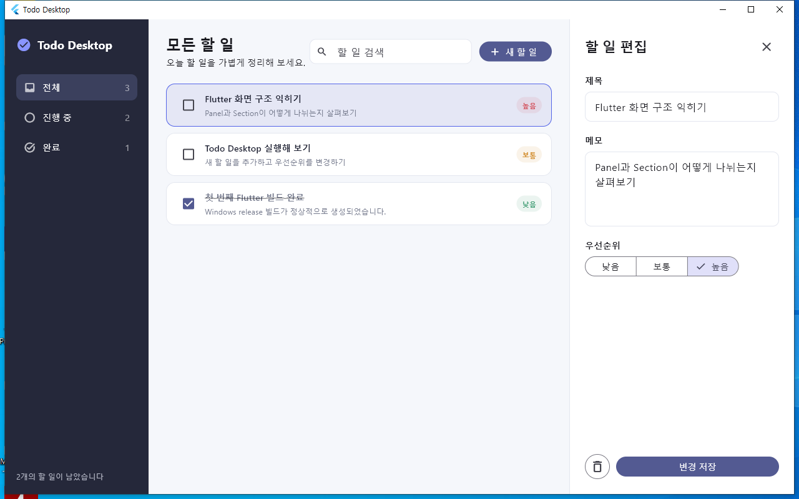

# Todo Desktop

Flutter로 만든 로컬 전용 데스크톱 할 일 관리 앱이다.



## 화면 예시

상태별 필터와 검색으로 필요한 할 일을 빠르게 찾고, 완료 여부와 우선순위를 한눈에 확인할 수 있다.



목록에서 할 일을 선택하면 오른쪽 편집 영역에서 제목, 메모, 우선순위를 수정하거나 삭제할 수 있다.

## MVP 기능

- 할 일 추가, 수정, 삭제 및 완료 전환
- 낮음, 보통, 높음 우선순위
- 전체, 진행 중, 완료 상태 필터
- 제목과 메모 검색
- 운영체제 사용자 데이터 폴더의 JSON 파일에 자동 저장
- `Ctrl+N` 새 할 일 단축키

## 실행

Flutter 데스크톱 개발 환경을 준비한 뒤 프로젝트 루트에서 실행한다.

```bash
flutter pub get
flutter run -d windows
```

Linux 또는 macOS에서는 각각 `linux`, `macos` 디바이스를 선택한다.

## 검증

```bash
dart format --set-exit-if-changed .
flutter analyze
flutter test
```
